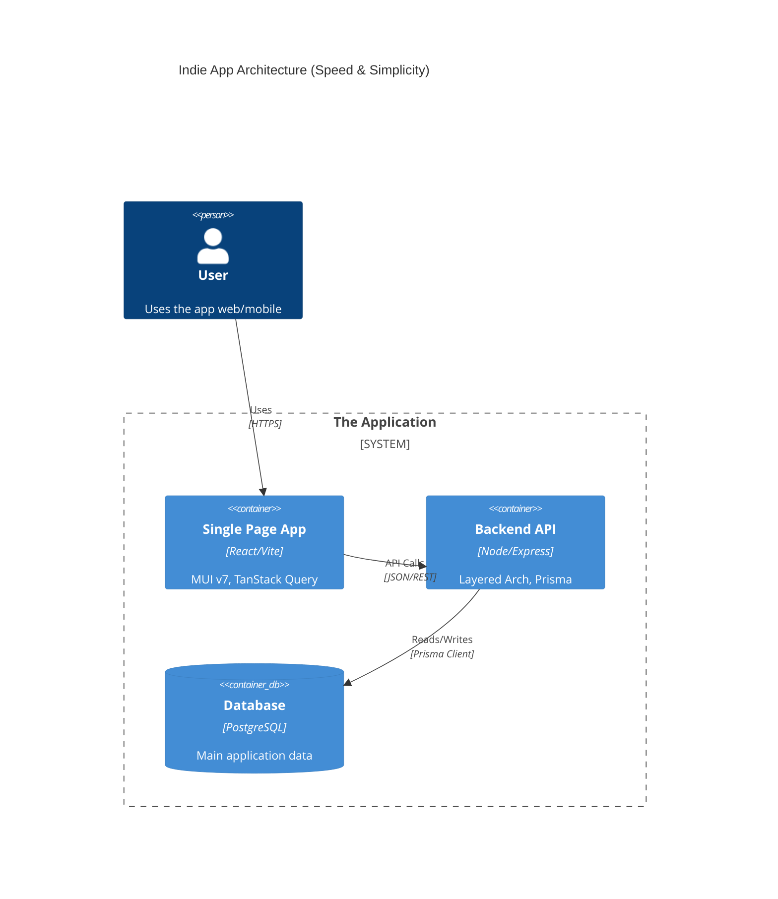
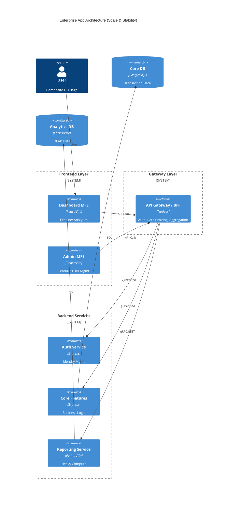

# Architecture Patterns (Mermaid Templates)

Use these templates to visualize the system structure before coding.

## 1. Indie App Pattern (Monolith / Simple 3-Tier)

Direct connection from Frontend to Backend API, sharing types.

## 2. Enterprise App Pattern (Microservices / Modular)

Introduction of API Gateway, separate services, and strict boundaries.

